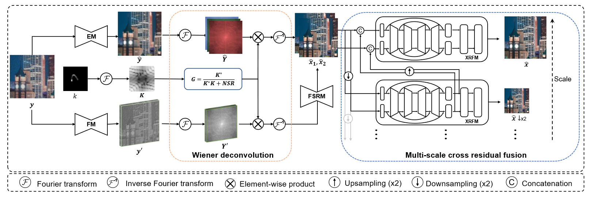

# INFWIDE: Image and Feature Space Wiener Deconvolution Network for Non-blind Image Deblurring in Low-Light Conditions

[This repository](https://github.com/zhihongz/INFWIDE) contains the PyTorch code for our paper "INFWIDE: Image and Feature Space Wiener Deconvolution Network for Non-blind Image Deblurring in Low-Light Conditions" by [Zhihong Zhang](https://zhihongz.github.io/), Yuxiao Cheng, Jinli Suo, Liheng Bian, and Qionghai Dai.

> [paper]() | [arxiv](https://arxiv.org/abs/2207.08201)

## INFWIDE

Blur, noise, and saturation are three major challenges for night photography. Although existing deblurring algorithms have shown promising performance on well-exposed blurry images, they still have difficulty in coping with low-light snapshots due to the sophisticated noise and saturation issue in low-light conditions.



In this work, we propose a novel non-blind deblurring method dubbed image and feature space Wiener deconvolution network (INFWIDE) to tackle these problems systematically. INFWIDE proposes a two-branch architecture, which explicitly removes noise and hallucinates saturated regions in the image space and suppresses ringing artifacts in the feature space, and integrates the two complementary outputs with a subtle multi-scale fusion network for high quality night photograph deblurring. For effective network training, we design a set of loss functions integrating a forward imaging model and backward reconstruction to form a close-loop regularization to secure good convergence of the deep neural network. Further, to optimize INFWIDE’s applicability in real low-light conditions, a physical-process-based low-light noise model is employed to synthesize realistic noisy night photographs for model training. Taking advantage of the traditional Wiener deconvolution algorithm’s physically driven characteristics and arisen deep neural network’s representation ability, INFWIDE can recover fine details while suppressing the unpleasant artifacts during deblurring.

## NightShot Dataset

To faciliate the development of low-light deblurring neural networks, we extend the low-light image dataset from Chen et al. and propose a larger dataset **NightShot**, which consists of various outdoor and indoor scenarios taken under low illuminations, including landscapes, streets, bars, bedrooms, etc. NightShot contains 3200 images in total, which are further divided into two separate parts as the training and testing datasets, which contain 3000 images and 200 images, respectively.

> L. Chen, J. Zhang, J. Pan, S. Lin, F. Fang, and J. S. Ren, “Learning a non-blind deblurring network for night blurry images,” in Proceedings of the IEEE/CVF Conference on Computer Vision and Pattern Recognition, 2021, pp. 10 542–10 550.

Dataset link: https://pan.baidu.com/s/1N_yLVDzCEktVkvkqeoduKQ?pwd=0000

## Requirements

```
torch>=1.1
torchvision
numpy
hydra-core>=1.0.
hydra_colorlog
omegaconf
tqdm
tensorboard>=1.14
matplotlib
opencv
scikit-image
```

## How to run

1. configurate your conda environment according to the requirements above.

2. download the pretrained model from [this link](https://pan.baidu.com/s/1N_yLVDzCEktVkvkqeoduKQ?pwd=0000), and put it into './model_zoo/infwide/'.

3. run `python test.py`

## Citation

```
@misc{zhang2022infwide,
      title={INFWIDE: Image and Feature Space Wiener Deconvolution Network for Non-blind Image Deblurring in Low-Light Conditions}, 
      author={Zhihong Zhang and Yuxiao Cheng and Jinli Suo and Liheng Bian and Qionghai Dai},
      year={2022},
      eprint={2207.08201},
      archivePrefix={arXiv},
      primaryClass={cs.CV}
}
```

## Acknowledgement

The implementation of INFWIDE borrows some useful codes from the following repositories. We thank their authors for their open-source spirit.

- https://gitlab.mpi-klsb.mpg.de/jdong/dwdn

- https://github.com/cszn/KAIR
